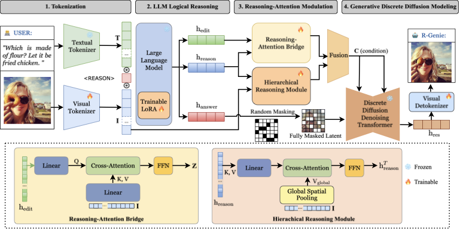
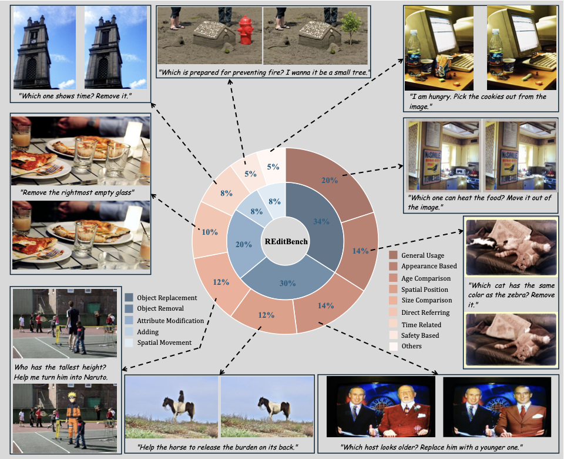
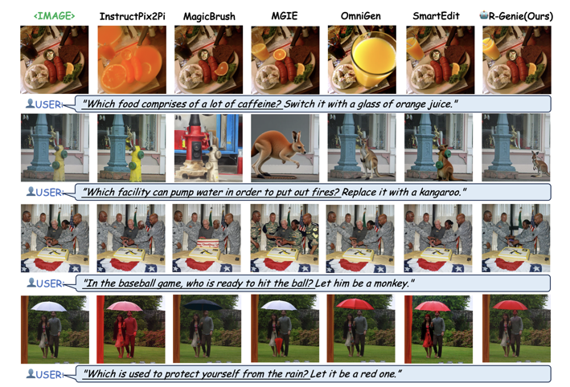

# R-Genie: Reasoning-Guided Generative Image Editing

[Project Page](https://dongzhang89.github.io/RGenie.github.io/)

R-Genie is a reasoning-guided generative image editing model built on top of Show-o. It combines multimodal tokenization, latent reasoning-to-visual modulation, and masked discrete diffusion to handle image editing instructions that require implicit intention understanding and contextual reasoning.

## Method Overview

R-Genie follows the paper's three-stage design:

1. Multimodal tokenization converts the source image, target image, and instruction into a shared token space.
2. The Hierarchical Reasoning Module and Reasoning-Attention Bridge ground instruction reasoning into global and local visual features.
3. Masked latent modeling reconstructs target visual tokens from a corrupted target sequence, conditioned on the source image and reasoning features.



[View high-resolution PDF](docs/arch.pdf)

## Dataset Samples

The editing dataset contains image-instruction-target triples that require reasoning over attributes, objects, spatial relations, age, appearance, time, safety, and general world knowledge.



[View high-resolution PDF](docs/dataset_sample.pdf)

## Results

R-Genie improves reasoning-aware editing while preserving background consistency and visual fidelity.



[View high-resolution PDF](docs/results.pdf)

## Repository Structure

```text
configs/
  RGenie_tuning_for_editing.yaml
docs/
  arch.pdf
  dataset_sample.pdf
  results.pdf
  images/
  rgenie_architecture.md
models/
  RGenie.py
  rgenie_components.py
  modeling_showo.py
  modeling_magvitv2.py
  phi.py
training/
  train_edit.py
  rgenie_pipeline.py
  edit_dataset.py
  prompting_utils.py
  utils.py
```

## Data Format

Place the editing dataset under `data/`:

```text
data/
  imgs/
  gt/
  editing_instruction_dict.json
```

`imgs/` stores source images, `gt/` stores target edited images, and `editing_instruction_dict.json` maps image ids to instructions.

## Model Components

Download or prepare the following model folders:

- `hf_model/show-o`
- `hf_model/magvitv2`
- `hf_model/phi-1_5`
- `hf_model/R-Genie`

The current training entrypoint uses `configs/RGenie_tuning_for_editing.yaml` by default.

## Training

```bash
deepspeed --master_port=24999 training/train_edit.py config=./configs/RGenie_tuning_for_editing.yaml exp_name=showo-edit
```

You can also run:

```bash
bash run.sh
```

## Architecture Notes

See [docs/rgenie_architecture.md](docs/rgenie_architecture.md) for a short mapping from the paper's method sections to the current code modules.
